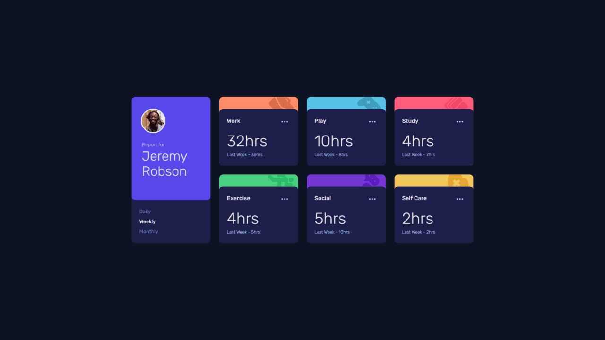

# Frontend Mentor - Time tracking dashboard solution

This is a solution to the [Time tracking dashboard challenge on Frontend Mentor](https://www.frontendmentor.io/challenges/time-tracking-dashboard-UIQ7167Jw). Frontend Mentor challenges help you improve your coding skills by building realistic projects.

## Table of contents

- [Overview](#overview)
  - [The challenge](#the-challenge)
  - [Screenshot](#screenshot)
  - [Links](#links)
- [My process](#my-process)
  - [Built with](#built-with)
  - [What I learned](#what-i-learned)
- [Author](#author)

## Overview

### The challenge

Users should be able to:

- View the optimal layout for the site depending on their device's screen size
- See hover states for all interactive elements on the page
- Switch between viewing Daily, Weekly, and Monthly stats

### Screenshot



### Links

- Solution URL: [Solution](https://www.frontendmentor.io/solutions/time-tracking-dashboard-tailwind-and-reactjs-3SXkrCmxd7)
- Live Site URL: [Website](https://time-tracking-dashboard-main-gilt.vercel.app/)

## My process

### Built with

- Semantic HTML5 markup
- CSS custom properties
- Flexbox
- CSS Grid
- Mobile-first workflow
- [React](https://reactjs.org/) - JS library
- [Tailwind CSS](https://tailwindcss.com/) - For styles

### What I learned

```js
/** @type {import('tailwindcss').Config} */
export default {
  safelist: ["bg-work", "bg-play", "bg-study", "bg-exercise", "bg-social", "bg-self-care", "text-white", "text-blue-pale"],
};
```
[About Safelisting](https://tailwindcss.com/docs/content-configuration#safelisting-classes)

## Author

- Website - [My Portfolio](https://portifoliov2-client.vercel.app/)
- Frontend Mentor - [@N1NHOS0](https://www.frontendmentor.io/profile/NINHOS0)
- Linkedin - [My Linkedin](https://www.linkedin.com/in/renan-polido-805a66248/)
